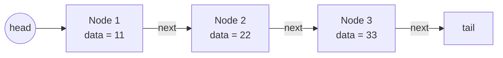

## 대응하는 소스

- `data_structure/linked_list/linked_list.h`
- `data_structure/linked_list/linked_list.c`

이 문서는 위 두 파일의 현재 구현과 1:1로 대응한다.


## TL;DR

연결 리스트는 포인터를 이용해 떨어진 메모리의 노드를 하나의 순서로 연결한다  
반복시간은 요소에 비례한다 ( O(n) )  
수정/삭제 가 편하지만, 시간 소요 증가 및  메모리 관리가 더 필요


## 개요

연결 리스트는 각각의 노드가 다음 노드의 주소를 저장하여 연결되는 자료구조다.
이 문서에서는 이해한 범위 내 연결 리스트 설명한다


## 구조와 동작 원리

```c
typedef struct NODE {
  int number;
  int data;
  struct NODE* next;
} Node;
```

각 노드는 데이터와 다음 노드를 가리키는 `next` 포인터를 가지고
필요하다면, 식별번호를 둘 수 있다
`head`부터 `next`를 따라 순회하며, 마지막 노드의 `next` ( `tail` )는 `NULL`이다.



## 주의사항 

힙 메모리에 영역에 노드를 생성하는 것임으로, 연결 리스트의 사용이 다 다 되었을 경우 꼭 메모리 해제와 포인터 NULL 처리가 필요하다  

중간의 노드를 제거할 경우, 노드의 정보 갱신이 없다면, 삭제요소 이후의 노드는 쓰레기 상태가 된다

## 구현
```c

typedef struct NODE {
  int number;
  int data;
  struct NODE* next;
} Node;

/**
 * @brief 연결 리스트를 순회하며 각 노드의 값을 출력하는 함수
 * @param node 출력할 연결 리스트의 첫 번째 노드 포인터
 * @return void 리턴 되는 값 없음
 */
void displayNode(Node* node) {
  while(node != NULL) {
    printf("number : %d,\tdata : %d\n", node->number, node->data);
    node = node->next;
  }
}

/**
 * @brief 주어진 노드부터 연결된 모든 노드의 메모리를 재귀적으로 해제
 * @param node 해제할 연결 리스트의 첫 번째 노드 포인터
 * @return Node* 항상 NULL을 반환하여 호출자가 포인터를 NULL처리할 수 있도록 함
 * @note 재귀 방식으로 동작하며, 후위(post-order) 순회로 자식 노드부터 메모리 해제
 */
Node* clearNode(Node* node) {

  // recursion end condition
  if(node->next == NULL) {
    return NULL;
  }

  // recursion
  node->next = clearNode(node->next);

  // recursion action
  free(node);

  // recursion return value
  return NULL;
}

/**
 * @brief 연결 리스트를 출력 및 제거하기 위한 함수
 * @param void
 * @return void
 * @note  테스트용도의 함수
 */
void testLinkedList(void);

typedef struct NODE {
  int number; // 선택사항
  int data;
  struct NODE* next;
} Node;

int size;

Node head = {
  .data = 64
  .next = NULL
};

// malloc
Node* first_node = malloc(sizeof(Node));

first_node->next = NULL;
head.next = first_node;


Node* second_node = malloc(sizeof(Node));

second_node->next = NULL;
first_node.next = second_node;

first_node = clearNode(first_node);
first_node->next = NULL;
head = clearNode(head); 
head->next = NULL;

```


<!-- ## 비고 -->

